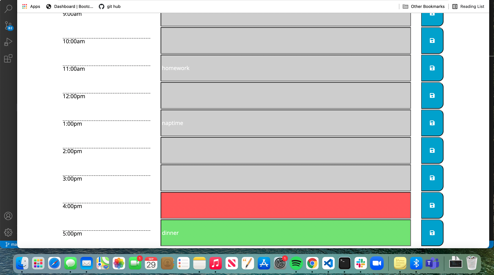

# dayPlanner

## description
Make a day planner that has text blocks that change color according to what time it is currently relative to the time slots on the 
planner. If a note is entered into a time block, that time block saves that message to local storage and retrieves it upon 
refreshing the page.

## method
To do this I wrote two chunks of code. For the local storage, I used jQuery to identify the button clicks. When a save button is clicked, it iterates over each text box and it pushes the text to an empty array. I then send that array to local storage. To retrieve the text for each specific textbox, I again used the each iteration so that each box is iterated over and as each 
textbox is iterated over it checks a specific index in the array. This is done by having the index and the box increase with every 
.each loop.
I then wrote the code of the color changing. I made a moment called now that represents the current time. I then made a variable 
that refers to the specific text box. I then take the hour from the now moment object and make it a number, and make the text box
time also a number. I then compare these two variables through >, <, ==. with these if/else if/else statements I add the correct class styling. I made a for loop that runs through every text box hour
and also set a class on each textbox that gets iterated through so that I can move onto the next text box.

## screenshot

<!--  -->

## links

https://emilyelizabethdaniel.github.io/dayPlanner/

https://github.com/emilyelizabethdaniel/dayPlanner